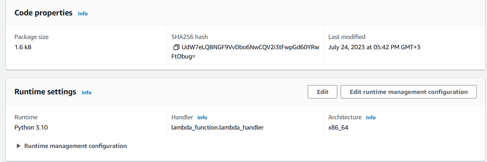
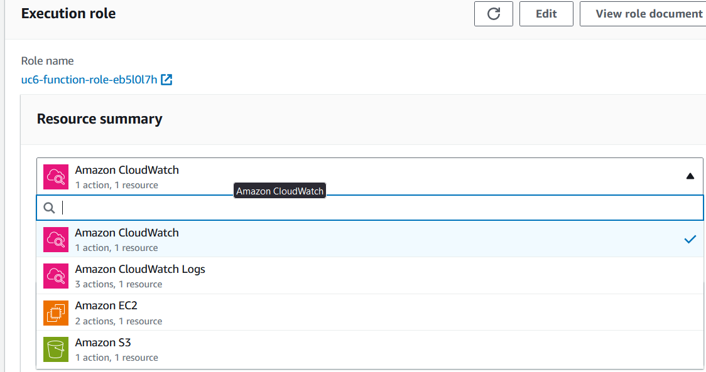
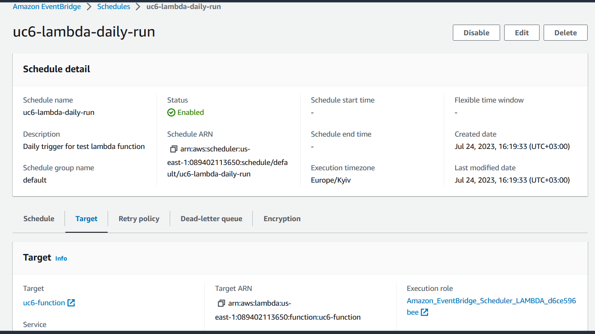
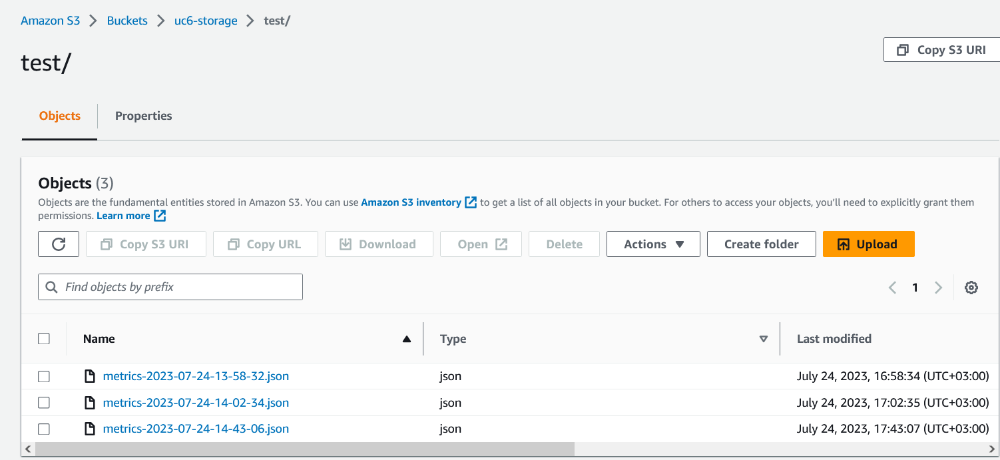
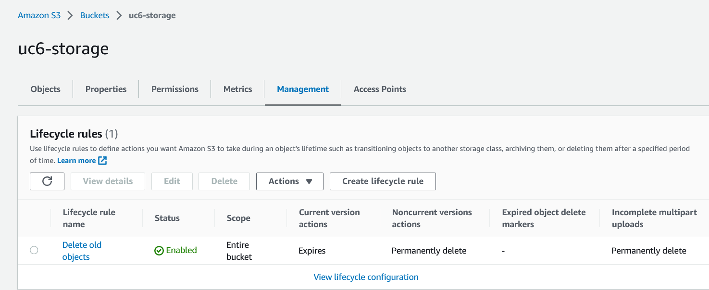
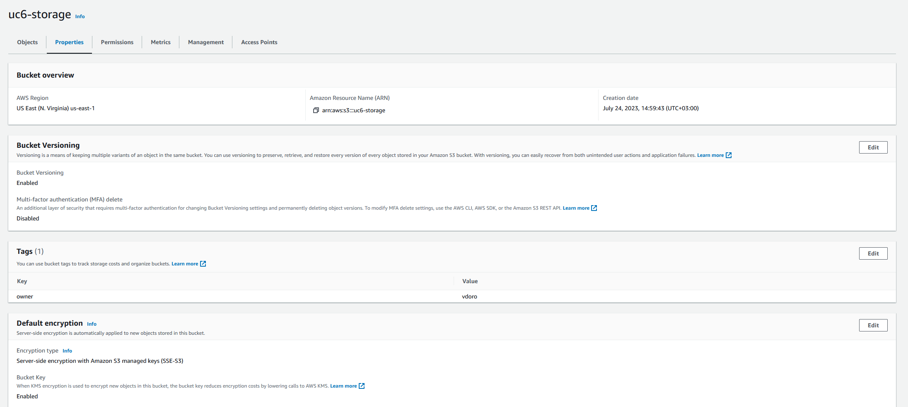

# generative-ai-research
This script and all policies were created with AI usage.
Time spent: 3.5 hours
- Creating infrastructure and initial script development 1 hour
- Script refactoring 1 hour
- Gathering reports and filling forms 1.5 hours

Acceptance criteria:
- The function is created by using Python: 
  - Lambda function: [uc6-function](https://us-east-1.console.aws.amazon.com/lambda/home?region=us-east-1#/functions/uc6-function?tab=code)
  - 
- The function has a role with permissions to collect metrics and write them to a storage:
  - IAM policy [uc6-lambda-policy](https://us-east-1.console.aws.amazon.com/iamv2/home#/policies/details/arn%3Aaws%3Aiam%3A%3A089402113650%3Apolicy%2Fuc6-lambda-policy?section=policy_permissions)
  - 
  ```
  {
      "Version": "2012-10-17",
      "Statement": [
          {
              "Effect": "Allow",
              "Action": [
                  "ec2:DescribeVolumes",
                  "ec2:DescribeSnapshots"
              ],
              "Resource": "*"
          },
          {
              "Effect": "Allow",
              "Action": [
                  "s3:PutObject"
              ],
              "Resource": "arn:aws:s3:::uc6-storage/*"
          },
          {
              "Effect": "Allow",
              "Action": [
                  "logs:CreateLogGroup",
                  "logs:CreateLogStream",
                  "logs:PutLogEvents"
              ],
              "Resource": "arn:aws:logs:*:*:*"
          },
          {
              "Effect": "Allow",
              "Action": [
                  "cloudwatch:PutMetricData"
              ],
              "Resource": "*"
          }
      ]
  }
  ```
- The function is tested and verified to collect the required metrics once a day using cloud SDK (for scheduling in AWS use AWS EventBridge, for scheduling in GCP use Cloud Scheduler which calls HTTP triggered Cloud Function)
  - Cron schedule [uc6-lambda-daily-run](https://us-east-1.console.aws.amazon.com/scheduler/home?region=us-east-1#schedules/default/uc6-lambda-daily-run)
  - 
- The function stores the collected metrics as JSON files in cloud storage
  - S3 bucket with script output: [uc6-storage](https://s3.console.aws.amazon.com/s3/buckets/uc6-storage?region=us-east-1&tab=objects)
  - 
- The storage is configured with encryption, lifecycle policies, and access control. 
  - 
  - 

Script output samples:
- Initial version: [metrics.json](./metrics.json)
- Interhim report: [metrics-2023-07-24-14-02-34.json](./metrics-2023-07-24-14-02-34.json)
- Final multiregion report [metrics-2023-07-24-14-43-06.json](./metrics-2023-07-24-14-43-06.json)